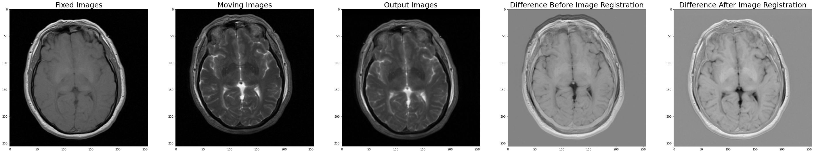
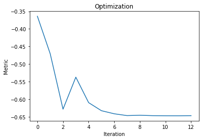

# Image Registration

## Dataset

Task on hand is to register T2-Weighted MRI volume to a T1-Weighted MRI volumes of the same subject acquired as a part of Female data set of Visible Human Project. 

A slice of  T1-weighted 3D MRI image stack and T2-weighted 3D MRI image stack respectively.

Before image registration, translation in y direction is significant.

T1-weighted and T2-weighted MRI before image registration (4x4 grid on left, 2x2 grid on right.

T1-weighted MRI chosen as fixed image and T2 weighted MRI was chosen as moving image.

## Results

After image registration, both images overlap nicely. 😊

T1-weighted and T2-weighted MRI after image registration (4x4 grid on left, 2x2 grid on right.

Difference filter was applied between fixed image & moving image (difference before registration) and between registered image & fixed image (difference after registration).

Optimizer value at each iteration.

