# Image Registration

Registration is a process of determining the spatial transformation that maps points from one image to homologous points on another image. ITK registration framework contains pluggable components which allows user to choose right too for the specific application.

## Dataset

Task on hand is to register T2-Weighted MRI volume to a T1-Weighted MRI volumes of the same subject acquired as a part of Female data set of Visible Human Project. 

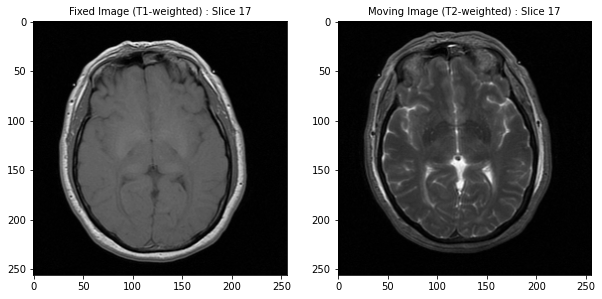

A slice of  T1-weighted 3D MRI image stack and T2-weighted 3D MRI image stack respectively.

Before image registration, translation in y direction is significant.

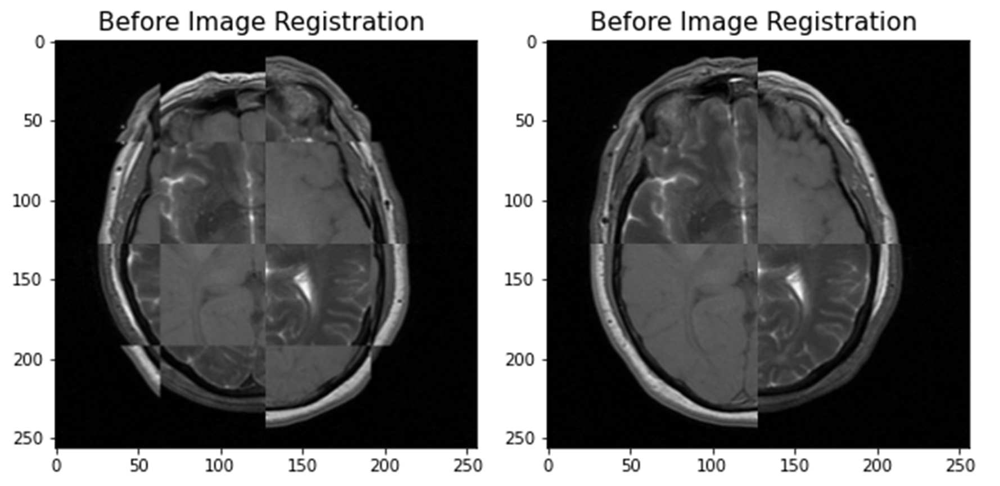

T1-weighted and T2-weighted MRI before image registration (4x4 grid on left, 2x2 grid on right.

T1-weighted MRI chosen as fixed image and T2 weighted MRI was chosen as moving image.

## Getting Started

Google Colaboratory notebook : 

[][https://colab.research.google.com/github/Mithunjha/ITK_ImageRegistration3D/blob/main/Registration.ipynb](https://colab.research.google.com/github/Mithunjha/ITK_ImageRegistration3D/blob/main/Registration.ipynb)

Demo on how to use the registration.py : 

[][https://colab.research.google.com/github/Mithunjha/ITK_ImageRegistration3D/blob/main/Registration.ipynb](https://colab.research.google.com/github/Mithunjha/ITK_ImageRegistration3D/blob/main/Registration.ipynb)

### Installation

```python
!pip install itk
```

### Git Cloning

```python
!git clone https://github.com/Mithunjha/ITK_ImageRegistration3D.git

%cd /content/ITK_ImageRegistration3D
```

### Run registration script

```python
!python registration.py "/content/drive/MyDrive/Registration/VF-MRT1-1014-1174.vtk" "/content/drive/MyDrive/Registration/VF-MRT2-1014-1174.vtk" "/content/drive/MyDrive/Registration"
# !python <scriptname> <fixedimagepath> <movingimagepath> <outputfolderpath>
```

## Method

Following functions are utilized for each component of registration framework.

1. Transform : itk.TranslationTransform()
2. Interpolator : itk.LinearInterpolateImageFunction()
3. Metric : itk.MattesMutualInformationImageToImageMetricv4()
4. Optimizer : itk.RegularStepGradientDescentOptimizerv4()
5. Registration : itk.ImageRegistrationMethodv4()

## Results

After image registration, both images overlap nicely. 😊

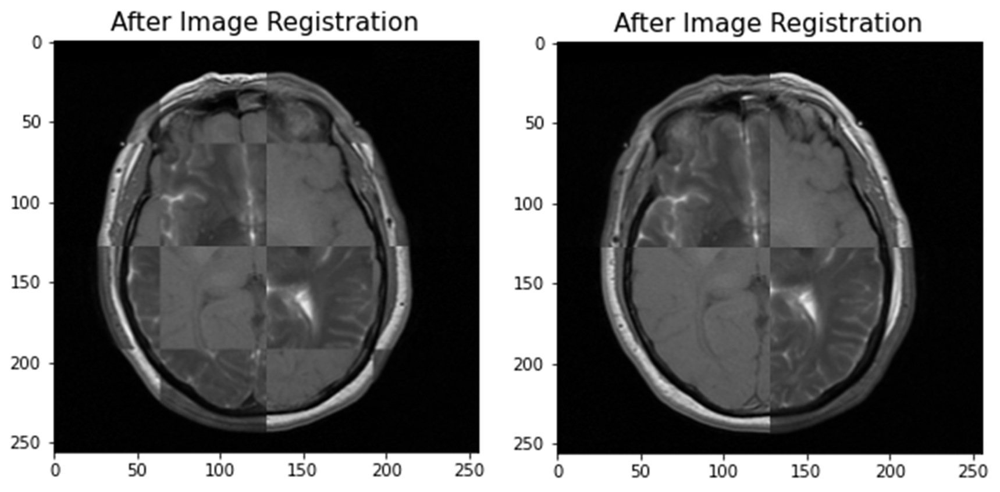

T1-weighted and T2-weighted MRI after image registration (4x4 grid on left, 2x2 grid on right.

Difference filter was applied between fixed image & moving image (difference before registration) and between registered image & fixed image (difference after registration).

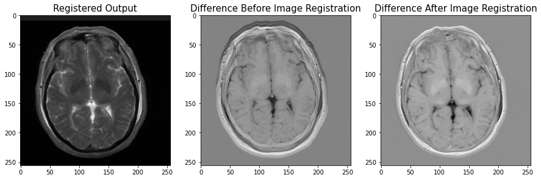

Difference images (subtraction filter) before and after registration. 

**Visualization with Slicer**

Fixed image vs moving image

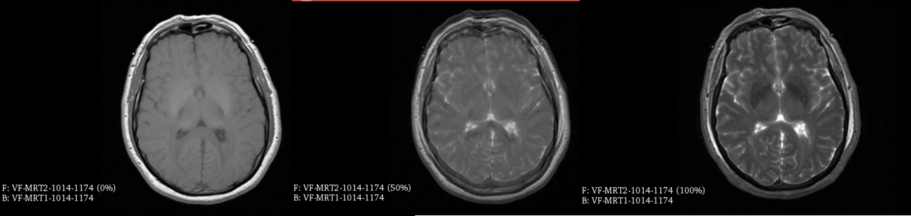

Registered image vs Fixed image

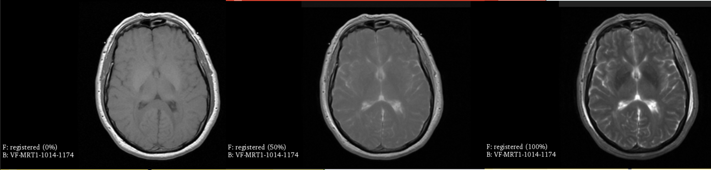

Moving image vs registered image

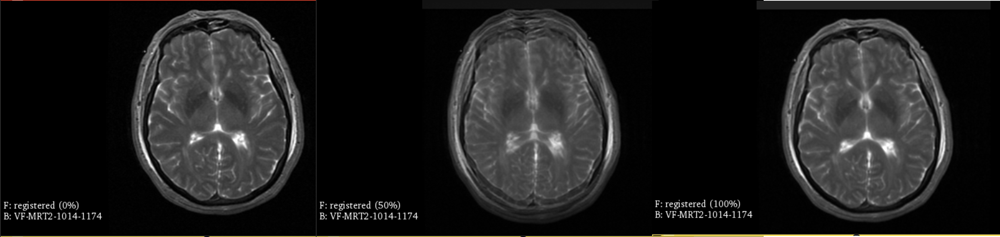

### Optimization

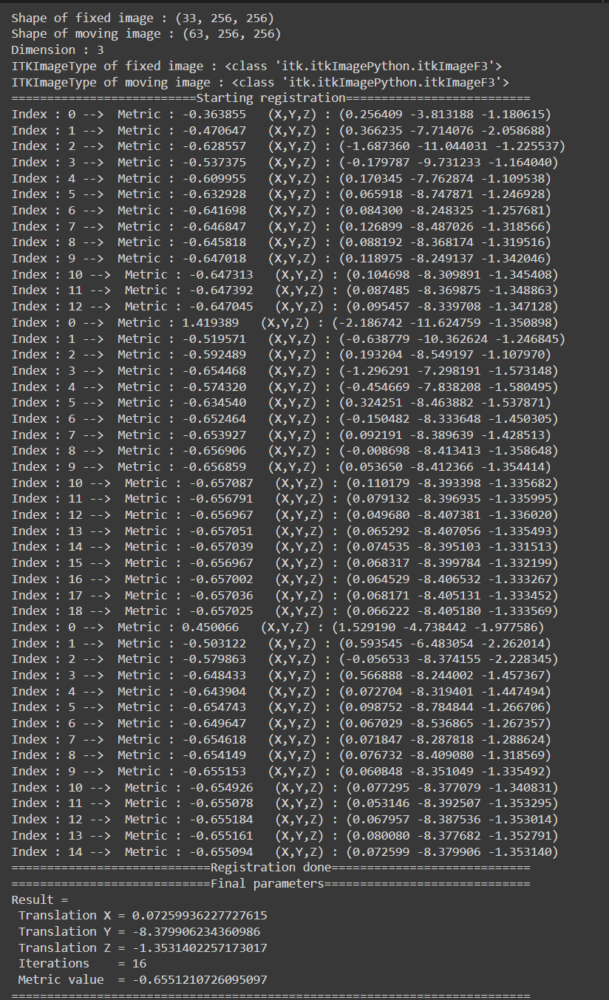

Total Optimization map

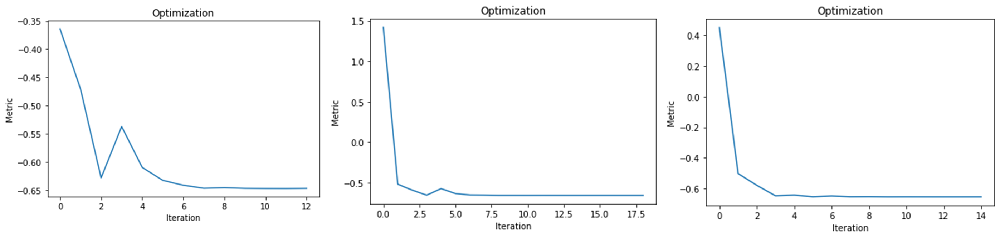

Optimization values at each level (Left to Right - level 0, level 1 and level2)

## Additional Qualitative Results

**Slice = 20**

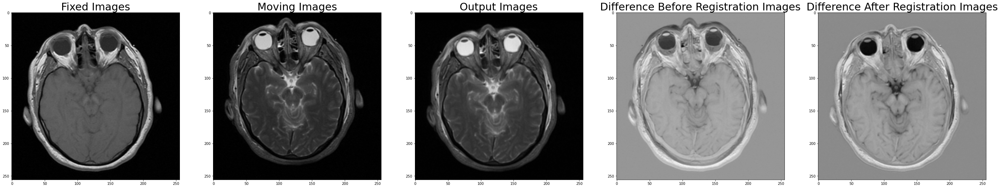

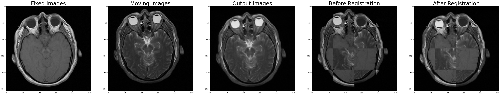

**Slice = 6**

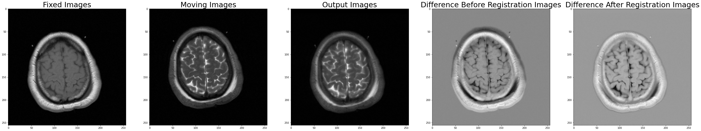

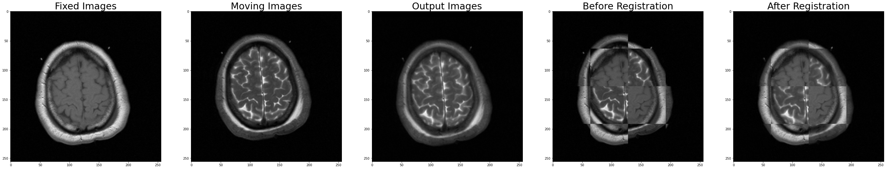